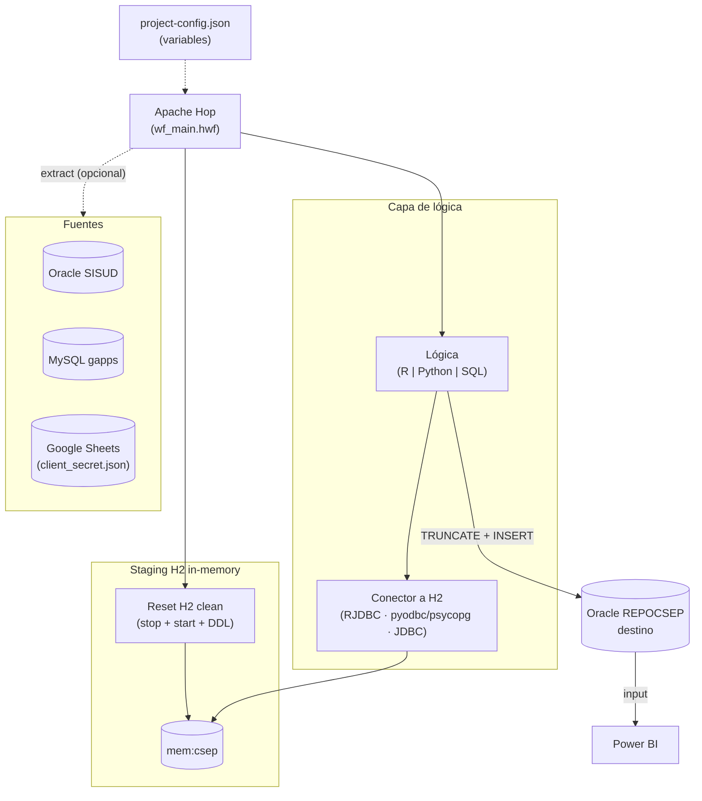

```mermaid
flowchart TD
    HOP["Apache Hop<br/>(wf_main.hwf)"]

    subgraph H2["Staging H2 in-memory"]
        RESET["Reset H2 clean<br/>(stop + start + DDL)"]
        DBH2[("mem:csep")]
    end

    subgraph LOGICA["Capa de lógica"]
        LOG["Lógica<br/>(R | Python | SQL)"]
        CONN["Conector a H2<br/>(RJDBC · pyodbc/psycopg · JDBC)"]
    end

    subgraph FUENTES["Fuentes"]
        ORASISUD[("Oracle SISUD")]
        MYSQL[("MySQL gapps")]
        SHEETS[("Google Sheets<br/>(client_secret.json)")]
    end

    ORAREPO[("Oracle REPOCSEP<br/>destino")]
    PBI["Power BI"]

    HOP --> RESET
    RESET --> DBH2
    HOP --> LOG
    LOG --> CONN --> DBH2
    LOG -->|"TRUNCATE + INSERT"| ORAREPO
    ORAREPO -->|"input"| PBI
    HOP -.->|"extract (opcional)"| FUENTES
    CONFIG["project-config.json<br/>(variables)"] -.-> HOP
```
