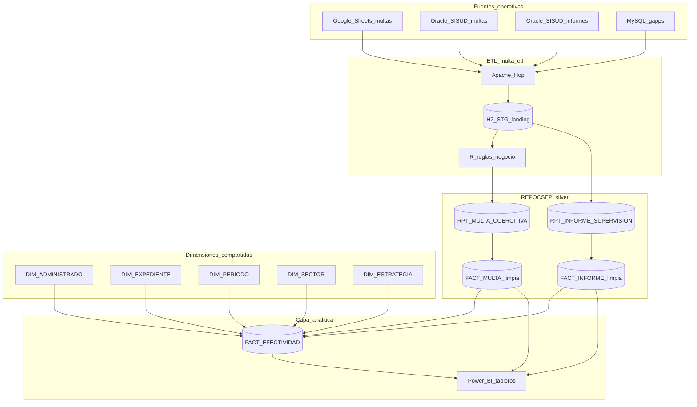

# Diagrama general — ETL + Data Warehouse (visión futura)

Vista a grandes rasgos. No detalla columnas, puentes ni literales del TDR.

**Lectura rápida**

1. **Fuentes** → Hop las baja a **H2 STG** (landing).
2. **Silver landing:** dos hechos (`RPT` multas / informes); multas pasan por R (UNION); informes van Hop-only.
3. **Silver depurado:** `FACT_*` limpios + **dimensiones** compartidas.
4. **Gold:** cruce de efectividad y consumo en BI — **sin mezclar granos** en una sola tabla cruda.
