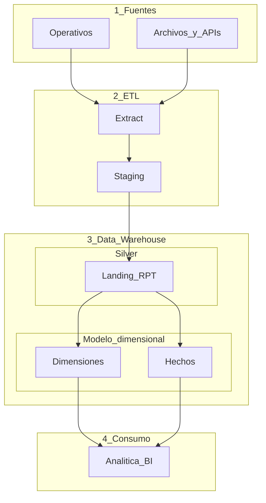

# Diagrama general — flujo de datos

```mermaid
flowchart TB
  subgraph origen [1_Fuentes]
    Op[Operativos]
    Archivos[Archivos_y_APIs]
  end

  subgraph etl [2_ETL]
    Extract[Extract]
    Stage[Staging]
  end

  subgraph dwh [3_Data_Warehouse]
    subgraph silver [Silver]
      Landing[Landing_RPT]
    end
    subgraph modelo [Modelo_dimensional]
      Dims[Dimensiones]
      Hechos[Hechos]
    end
  end

  subgraph consumo [4_Consumo]
    Analitica[Analitica_BI]
  end

  Op --> Extract
  Archivos --> Extract
  Extract --> Stage
  Stage --> Landing
  Landing --> Dims
  Landing --> Hechos
  Dims --> Analitica
  Hechos --> Analitica
```
