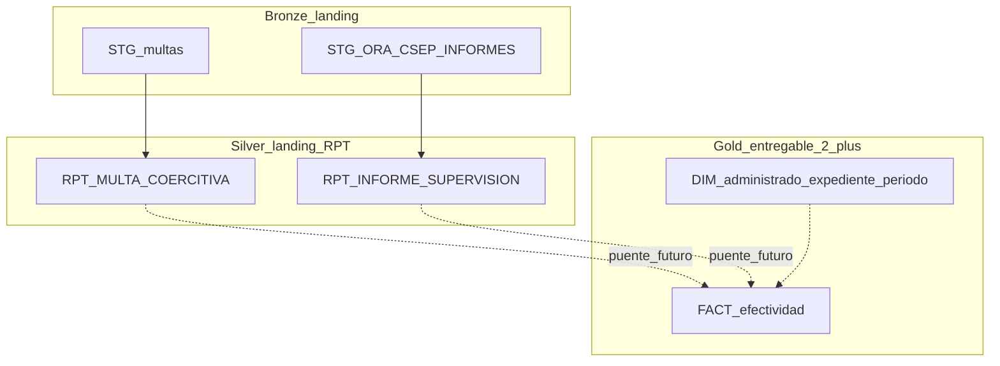

# Data warehouse futuro: informes + multas (literal f TDR)

Documento de diseño para el **entregable 2+** (REQ 3629-2026).  
**No implementa** el cruce ni dimensiones: el entregable 1 solo deja dos hechos cargados y auditables.

## 1. Qué pide el literal f

Procesar y analizar la información sistematizada en **informes de supervisión** y **multas coercitivas**, con técnicas de análisis de datos, para evaluar la **efectividad** de las estrategias de promoción del cumplimiento (avances, brechas, oportunidades de mejora).

Eso **no** es “apilar todo en una sola tabla”. Son dos universos de negocio con granos distintos.

## 2. Qué ya queda en el entregable 1

| Hecho en REPOCSEP | Origen | Carga |
|---|---|---|
| `RPT_MULTA_COERCITIVA` | Sheets GS1/GS2 + etapas + `VW_MULTA_COERCITIVA` + MySQL gapps | Hop STG + R UNION `FUENTE` |
| `RPT_INFORME_SUPERVISION` | `SISUD.CSEP_INFORMES_VIEW` | Hop STG + Hop RPT (sin R) |

Capas actuales (bronze operativo del arquetipo CSEP):

## 3. Modelo objetivo (DWH liviano en REPOCSEP)

### 3.1 Hechos (no mezclar)

| Tabla | Grano | Llave natural candidata |
|---|---|---|
| `RPT_INFORME_SUPERVISION` | 1 actividad / informe | `IDACTIVIDAD` |
| `RPT_MULTA_COERCITIVA` | 1 fila por origen (`FUENTE`) | `COD_MA` o `CUM` según `FUENTE` |

Tras depuración (literal d) conviene materializar hechos “limpios”, por ejemplo:

- `FACT_INFORME` (1 fila / `IDACTIVIDAD`, dominios homologados)
- `FACT_MULTA` (1 fila / multa de negocio, sin duplicar planilla+SISUD a ciegas)

### 3.2 Dimensiones compartidas (entregable 2)

| Dimensión | Insumos |
|---|---|
| `DIM_ADMINISTRADO` | `TXADMINISTRADO` / `ADMINISTRADO` / `ADM` |
| `DIM_EXPEDIENTE` | `TXNUMEXP`, `NUMERO_EXPEDIENTE`, `EXP_INF_INCUMP` |
| `DIM_PERIODO` | `FEINFORME`, `FECHA_EMISION`, fechas Sheets |
| `DIM_SECTOR` | `TXCOORDINACION`, `TXSUBSECTOR_UND`, sufijos OD en `COD_MA` |
| `DIM_ESTRATEGIA` | `TXRECOMENDACION` (INICIAR PAS / ARCHIVAR / nulo), `AMERIT_MC`, estados de multa |

### 3.3 Puentes candidatos (a probar, no asumir)

| Cruce | Riesgo observado |
|---|---|
| `TXNUMEXP` ↔ `NUMERO_EXPEDIENTE` / `EXP_INF_INCUMP` | En la muestra del dump, `TXNUMEXP` aparece muy nulo |
| `TXADMINISTRADO` ↔ `ADMINISTRADO` | Fuzzy match / normalización de razón social |
| `TXCUC` ↔ códigos de planilla | No equivale a `CUM` ni a `COD_MA` sin regla CSEP |
| `COD_MA` ↔ `CUM` | Ya diagnosticado en entregable 1: intersección 0 |

Hasta tener cobertura de puente validada por el área usuaria, los tableros deben filtrar por hecho (`informe` vs `multa`) y no sumar 626 + N_informes como “un solo universo”.

## 4. Capas bronze / silver / gold (alineadas al arquetipo)

| Capa | Artefacto CSEP | Responsable TDR |
|---|---|---|
| Bronze | H2 `STG_*` | a (consolidar) |
| Silver landing | `RPT_*` actuales | a–c |
| Silver depurado | `FACT_*` / tablas limpia | d–e |
| Gold | indicadores, cruce efectividad, salidas BI | f–h |

Controles de trazabilidad (literal e): por corrida, `COUNT` origen = STG = RPT por fuente; tabla de excepciones si se filtran filas.

## 5. Roadmap temporal

| Momento | Entregable | Qué hacer |
|---|---|---|
| Ahora (~mes 1) | **1** | Dos RPT cargadas; diccionarios; métricas de calidad (nulos, duplicados, `#N/A`, puentes imposibles) |
| ~mes 2 | **2** | Depurar/homologar; controles e; análisis f con informes + multas (aún separados o solo sobre el subconjunto cruzable) |
| Luego | **3** | Cuadros g; hallazgos h |

## 6. Implicancia para Power BI / consumo

- Un dataset por hecho, o un modelo estrella con dos hechos y dimensiones compartidas.
- No un único `COUNT(*)` sobre un UNION de informes+multas.
- `TXRECOMENDACION` y `AMERIT_MC` / `ESTADO_*` son candidatos a medir “estrategia” una vez homologados.

## 7. Referencias en el repo

- Skill: `.agents/skills/oefa-csep-etl/SKILL.md`
- Pipelines informes: `pipelines/pl_stage_informes.hpl`, `pipelines/pl_rpt_informes.hpl`
- DDL RPT: `sql/create_ORACLE_RPT_INFORME_SUPERVISION.sql`
- Multas RPT: `sql/create_ORACLE_RPT_MULTA_COERCITIVA.sql`
- Orquestación: `workflows/wf_staging.hwf`
