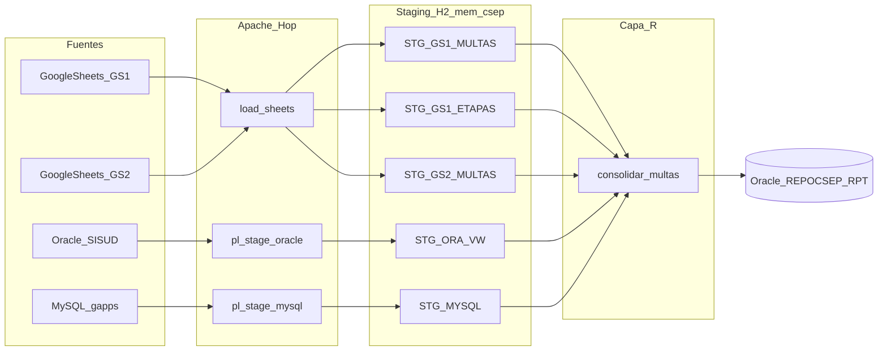
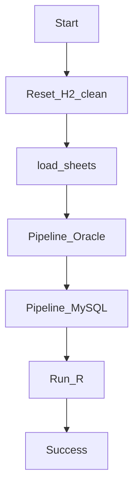
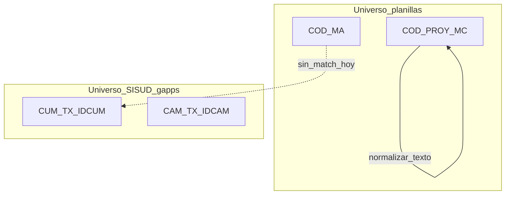

# INFORME TÉCNICO N.° 001-2026-OEFA/DPEF-CSEP

**A:**  
IGOR ELÍAS MEJÍA VERÁSTEGUI  
Director de la Dirección de Políticas y Estrategias en Fiscalización Ambiental del OEFA

**Asunto:** Primer entregable — actividades a), b) y c) del numeral 6 de los TDR  
Requerimiento N.° **3629-2026** (análisis de datos e implementación de técnica para procesamiento de datos — evaluación de la efectividad de las estrategias de promoción del cumplimiento, con énfasis en **multas coercitivas**).

**Ref.:** Términos de Referencia del Requerimiento N.° 3629-2026  
**Fecha:** Lima, 12 de agosto de 2026

Es grato dirigirme a usted para informarle el cumplimiento de las actividades **a), b) y c)** del numeral 6 de los TDR, correspondientes al **Primer Entregable**.

---

## 1. Objetivo y antecedentes

El presente informe sustenta el Primer Entregable del servicio de análisis de datos e implementación de técnicas de procesamiento, consolidación, sistematización y validación de información relacionada con las estrategias de promoción del cumplimiento, **principalmente asociadas a multas coercitivas**, en el marco de la Coordinación de Sistematización, Estadísticas y Optimización de Procesos (CSEP) de la DPEF.

Conforme al numeral 7 de los TDR, el Primer Entregable comprende un (01) informe detallando el cumplimiento de:

| Literal | Actividad (TDR, numeral 6) |
|---------|----------------------------|
| **a)** | Consolidar la información de informes de supervisión y **multas coercitivas**, integrando bases de datos, registros, reportes, formularios u otras fuentes proporcionadas. |
| **b)** | Revisar la estructura y contenido de las bases disponibles, verificando correspondencia entre campos, variables, criterios de clasificación, periodos e indicadores. |
| **c)** | Validar completitud, consistencia y coherencia: incompletos, duplicados, inconsistentes, valores fuera de rango, errores de codificación u otros hallazgos de calidad. |

Las actividades **d) a h)** (depuración/estandarización, controles de calidad de trazabilidad, análisis de efectividad, cuadros estadísticos y hallazgos de gestión) corresponden a los entregables segundo y tercero; **no se desarrollan en este documento**, salvo menciones de alcance o riesgos que condicionan esas fases.

### 1.1 Marco institucional (síntesis)

- Ley N.° 29325 (SINEFA) y ROF del OEFA (art. 42°, DPEF).
- CSEP (R.P.C.D. N.° 009-2018-OEFA/PCD): sistematización, estadísticas e insumos técnicos de fiscalización ambiental.
- Memorando Circular N.° 00004-2026-OEFA/PCD: priorización de mecanismos de promoción del cumplimiento.
- POI CSEP — tarea 014584: *Visualización y comunicación de la información estadística de los procesos de fiscalización ambiental del SINEFA*.

### 1.2 Alcance técnico de esta etapa

Se implementó y ejecutó un flujo ETL institucional (**proyecto `multa_etl`**, motor **Apache Hop** + staging **H2 in-memory** + consolidación **R**) que integra las fuentes de **multas coercitivas** entregadas por el área usuaria, las deposita en un área de *landing* y produce una tabla analítica inicial en el repositorio Oracle **REPOCSEP**.

**Fuera de alcance del Primer Entregable:** join matched definitivo `COD_MA` ↔ `CUM`, depuración normativa de categorías, indicadores de efectividad y tableros Power BI.

---

## 2. Resumen ejecutivo

| Ítem | Componente del entregable | Descripción resumida | Herramientas | Estado |
|------|---------------------------|----------------------|--------------|--------|
| 1.0 | **A** — Consolidación e integración de fuentes | Conexión y carga de 4 orígenes (2 Google Sheets / 3 hojas, vista Oracle SISUD, tabla MySQL gapps) hacia H2 `STG_*` y UNION hacia `RPT_MULTA_COERCITIVA`. | Apache Hop, Google Sheets API (service account), JDBC Oracle/MySQL/H2, R 4.x, RJDBC | Completado (corrida 11/08/2026) |
| 2.0 | **B** — Estructura, campos e indicadores | Catálogo de variables por fuente, grano (1 fila = multa seguimiento / etapa / CUM / registro gapps), criterios de clasificación y periodos observables. | DDL H2, pipelines `.hpl`, DBeaver/H2 Shell, documentación de proyecto | Completado |
| 3.0 | **C** — Validación de calidad | Conteos, nulos, duplicados de `COD_MA`, `#N/A`, ausencia de puente Sheets↔SISUD, MySQL con CUM nulo. | Log Hop, consultas H2, script R `consolidar_multas.R` | Completado (diagnóstico; depuración = Entregable 2) |

**Resultado cuantitativo de la corrida de referencia (11/08/2026):**

| Fuente / tabla staging | Filas cargadas | Destino RPT (`FUENTE`) |
|------------------------|----------------|------------------------|
| Google Sheets GS1 — Multas coercitivas | 16 | `GS1` |
| Google Sheets GS1 — Etapas | 55 | `GS_ETAPA` |
| Google Sheets GS2 — Multas coercitivas (OD Lambayeque / CRES) | 21 | `GS2` |
| Oracle SISUD `VW_MULTA_COERCITIVA` | 530 | `ORA` |
| MySQL `gappsdb.T_MVC_MULTACOERCITIVA_MC` | 4 | `MYSQL` |
| **Total UNION** | **626** | `REPOCSEP.RPT_MULTA_COERCITIVA` |

---

## 3. Metodología

1. **Inventario de fuentes** proporcionadas por CSEP (Sheets de seguimiento, vista SISUD, tabla de aplicación gapps, plantillas Excel de mapeo).
2. **Arquitectura de capas:** extract (Hop) → landing H2 (`STG_*`, reset limpio por corrida) → consolidación R (UNION por `FUENTE`) → repositorio Oracle REPOCSEP (`RPT_*`).
3. **Revisión estructural (actividad b):** comparación de diccionarios (códigos de columna en fila de header de Sheets vs DDL Oracle/MySQL vs tabla RPT).
4. **Validación (actividad c):** métricas de completitud y unicidad sobre H2 post-carga; hallazgos de llaves y valores especiales (`#N/A`).
5. **Trazabilidad:** cada fila RPT conserva `FUENTE` y `FECHA_CARGA`; el workflow `wf_staging.hwf` es reproducible (Play en Hop).

> **Captura 1.** Pegar aquí captura del log Hop de `wf_staging` (Reset H2 → load_sheets → Oracle → MySQL → Run R).

---

## 4. Actividad a) — Consolidar e integrar fuentes

### 4.1 Fuentes integradas

Se consolidó la información de **multas coercitivas** a partir de cuatro orígenes heterogéneos (planillas de seguimiento + sistemas transaccionales), más una hoja auxiliar de **etapas** del proyecto de multa (GS1).

| N.° | Origen | Identificador / objeto | Autenticación | Destino landing (H2) |
|-----|--------|------------------------|---------------|----------------------|
| 1 | Google Sheets | Spreadsheet CAGR MA OEFA — hojas `1) Multas coercitivas` y `2) Etapas` (`SPREADSHEET_KEY_GS1`) | Service account `client_secret.json` | `STG_GS1_MULTAS_COERCITIVAS`, `STG_GS1_ETAPAS` |
| 2 | Google Sheets | Spreadsheet Medidas Administrativas OD Lambayeque — hoja `5) Multas Coercitivas` (`SPREADSHEET_KEY_GS2`) | Misma SA | `STG_GS2_MULTAS_COERCITIVAS` |
| 3 | Oracle producción SISUD | Vista `SISUD.VW_MULTA_COERCITIVA` — host `odaprod-scan`, servicio `oefabd`, puerto 1534, usuario `CSEPDV` | JDBC Oracle | `STG_ORA_VW_MULTA_COERCITIVA` |
| 4 | MySQL gapps | Tabla `gappsdb.T_MVC_MULTACOERCITIVA_MC` — host `10.1.1.217:3306`, usuario de aplicación | JDBC MySQL | `STG_MYSQL_T_MVC_MULTACOERCITIVA` |
| 5 | Oracle repositorio | Esquema `REPOCSEP` / `dvoefacore` (`10.6.0.15:1532`) | JDBC Oracle (escritura R) | `RPT_MULTA_COERCITIVA` |

Los Excel de `docs/input_examples/` se usaron **solo como plantilla de mapeo** (headers y tipos); la carga operativa lee **Google Sheets en vivo**, no los xlsx.

### 4.2 Arquitectura de consolidación

> **Captura 2.** Diagrama de arquitectura (exportar el mermaid o captura Hop GUI de `wf_staging.hwf`).

### 4.3 Orquestación (`wf_staging.hwf`)

Orden de ejecución:

1. **Reset H2 clean** — detiene/levanta H2 TCP `mem:csep:9092` y aplica `00_reset.sql` + `01_schema.sql` (cada corrida parte de schema vacío).
2. **load_sheets.hwf** — `pl_gs1_multas` → `pl_gs1_etapas` → `pl_gs2_multas` (`GoogleSheetsInput` + `client_secret.json`).
3. **pl_stage_oracle** — `Table Input` vista SISUD → `STG_ORA_*`.
4. **pl_stage_mysql** — `Table Input` gapps → `STG_MYSQL_*`.
5. **Run R** — `r/main.R` lee H2, ejecuta `r/logica/consolidar_multas.R` (UNION `FUENTE`) y escribe REPOCSEP.

> **Captura 3.** Canvas de Hop: `wf_staging.hwf` y `load_sheets.hwf`.

### 4.4 Criterio de consolidación del Primer Entregable (UNION)

Dado que las fuentes **no comparten aún una llave de negocio única** (ver actividad c), la consolidación física en una sola tabla se realizó por **apilado (UNION)** con columna `FUENTE` (`GS1`, `GS2`, `GS_ETAPA`, `ORA`, `MYSQL`), sin INNER JOIN entre mundos Sheets y SISUD. Ello permite:

- disponer de **todo el universo** en `RPT_MULTA_COERCITIVA` para auditoría y Power BI (filtro por `FUENTE`);
- no perder registros por un cruce prematuro;
- dejar el *match* `COD_MA` ↔ `CUM` para el Entregable 2 (depuración y reglas de negocio).

### 4.5 Repositorio destino

Tabla **`REPOCSEP.RPT_MULTA_COERCITIVA`**: CREATE en la primera escritura; en corridas siguientes TRUNCATE + INSERT. Incluye `FUENTE`, `FECHA_CARGA`, llaves normalizadas (`COD_MA`, `COD_PROY_MC`, `CUM`, `CAM`, `EXPEDIENTE`) y atributos de seguimiento, montos y estados (nullable según origen).

> **Captura 4.** DBeaver: `SELECT FUENTE, COUNT(*) FROM RPT_MULTA_COERCITIVA GROUP BY FUENTE`.

---

## 5. Actividad b) — Estructura, campos, clasificación, periodos e indicadores

### 5.1 Grano de cada base (qué representa una fila)

| Fuente | Grano | Llave natural observada | Observación |
|--------|-------|-------------------------|-------------|
| GS1 / GS2 Multas | 1 fila ≈ 1 medida/multa en seguimiento de planilla | `COD_MA` (ej. `0136-2021-0012-2022-1-CAGR`) | GS1 y GS2 no se solapan (ODs distintas: CAGR vs CRES/ODLAM). |
| GS1 Etapas | 1 fila ≈ 1 etapa de un proyecto de multa | `COD_PROY_MC` + `NRO_ETAPA_MC` | Relación 1:N con el proyecto (~5 etapas/proyecto en la muestra). |
| Oracle VW | 1 fila ≈ 1 multa en SISUD | `CUM` (11 dígitos) + `CAM` | Universo formal del core. |
| MySQL gapps | 1 fila ≈ 1 registro de la aplicación de seguimiento MC | `NU_IDMC`; negocio `TX_IDCUM` / `TX_IDCAM` | Muestra operativa pequeña (4 filas en corrida). |

### 5.2 Correspondencia de variables (diccionario resumido)

**Google Sheets GS1 — Multas (48 columnas de código en fila 3).** Incluyen identificación (`COD_MA`, `COD_PROY_MC`), organización (`JEFE`, `COORD`, `ADM`, `UF`), expediente de incumplimiento (`EXP_INF_INCUMP`), descargos (`N_CARTA_DCG`, `FN_MC`, `F_VENC_DCG`, `PRESENT_DCG_ADM`), análisis (`AMERIT_MC`, fechas), resolución (`N_RES_MC`, `F_VENC_MC`), montos (`MULTA_UIT`, `MULTA_S`), post-multa (`RECORD_SEG`, `F_VERIF_POST_MC`, `ESTADO_MC`, `F_PAGO`).

**GS2 — Multas (32 columnas):** subconjunto del seguimiento (sin `JEFE`/`COORD`/`COD_PROY_MC` de GS1); misma semántica de descargos, ameritación, resolución y pago.

**GS1 — Etapas (12 columnas):** `COD_PROY_MC`, `NRO_ETAPA_MC`, `ACCION_MC`, `ENCARGADO_MC`, `F_ASIG_MC`, `EST_ETAPA_MC`, `CONFORMIDAD_MC`, etc.

**Oracle `VW_MULTA_COERCITIVA` (13 columnas):** `NUMERO_EXPEDIENTE`, `ADMINISTRADO`, `RESOLUCION`, `FECHA_EMISION`, `NUMERO_REGISTRO`, `ESTADO_RESOLUCION`, `MEDIDA_ADMINISTRATIVA`, `CUM`, `CAM`, `MONTO_MULTA`, `MONTO_MULTA_REC`, `MONTO_MULTA_TFA`, `ESTADO_MULTA`.

**MySQL `T_MVC_MULTACOERCITIVA_MC` (18 columnas):** `NU_IDMC`, montos UIT/S, `TX_IDCUM`, `TX_IDCAM`, recordatorio, verificación post-MC, documentos SIGED, `FG_ESTADOMULTA`, auditoría de creación/modificación, `TX_ESTADOREGISTRO`, `TX_PASOACTUAL`.

**Homologación a RPT (campos puente):**

| Concepto de negocio | Sheets | Oracle | MySQL | Columna RPT |
|---------------------|--------|--------|-------|-------------|
| Código de medida / seguimiento | `COD_MA` | — | — | `COD_MA` |
| Proyecto de multa | `COD_PROY_MC` | — | — | `COD_PROY_MC` |
| Código único de multa | — | `CUM` | `TX_IDCUM` | `CUM` |
| Código de acto/multa CAM | — | `CAM` | `TX_IDCAM` | `CAM` |
| Expediente | `EXP_INF_INCUMP` | `NUMERO_EXPEDIENTE` | — | `EXPEDIENTE` |
| Monto S/ | `MULTA_S` | `MONTO_MULTA` | `NU_MONTOMCS` | `MONTO_S` |
| Estado | `ESTADO_MC` | `ESTADO_MULTA` | `FG_ESTADOMULTA` | `ESTADO` |

> **Captura 5.** Encabezados de Sheets (fila de códigos) y DDL de `01_schema.sql` / vista SISUD.

### 5.3 Criterios de clasificación identificados

- **Por origen institucional / OD:** sufijo de `COD_MA` (`CAGR`, `CRES`, `ODLAM`, …) y spreadsheet de origen (GS1 vs GS2).
- **Por sistema:** planilla de seguimiento (Sheets) vs registro SISUD (`ESTADO_RESOLUCION` / `ESTADO_MULTA` ACTIVO-INACTIVO) vs aplicación gapps (`FG_ESTADOMULTA`, `TX_PASOACTUAL`).
- **Por etapa de proyecto (solo GS1):** `ACCION_MC` (elaboración, revisión, cálculo, …) y `EST_ETAPA_MC`.
- **Por ameritación / cobranza (Sheets):** `AMERIT_MC`, `ETA_REG_PROY_MC`, `ESTADO_MC`, `ESTADO_PAGO_MC`.

### 5.4 Periodos de análisis observables (sin recorte aún)

En esta etapa **no se aplicó filtro de corte temporal** (eso es depuración, actividad d). Se observó:

- Sheets: fechas de notificación, vencimiento, firma de resolución, pago (formato mixto; API Sheets entrega `dd/MM/yyyy`).
- SISUD: `FECHA_EMISION` de la resolución de multa.
- MySQL: `FE_FECHA_CREACION` / `FE_FECHA_MODIFICACION` (registros 2026 en la muestra).

El periodo analítico definitivo (p. ej. desde 2016/2017, análogo a otros procesos CSEP) se propondrá en el Entregable 2, acordado con el área usuaria.

### 5.5 Indicadores vinculados (catálogo preliminar)

Aún no calculados (actividad g = Entregable 3). Se deja el **mapa de insumos** ya presente en las bases:

| Indicador tentativo | Insumo | Fuente |
|---------------------|--------|--------|
| N.° de multas en seguimiento | `COD_MA` distintos | GS1+GS2 |
| N.° de proyectos MC | `COD_PROY_MC` | GS1 |
| N.° de etapas / proyecto | `STG_GS1_ETAPAS` | GS1 |
| Stock SISUD | `CUM` / `ESTADO_MULTA` | ORA |
| Monto impuesto / rec / TFA | `MONTO_MULTA*` | ORA |
| Multas con pago / vencidas | `F_PAGO`, `F_VENC_MC` | Sheets |
| Cobertura de cruce Sheets–SISUD | match `COD_MA`–`CUM` o expediente | a definir |

---

## 6. Actividad c) — Validación de completitud, consistencia y coherencia

### 6.1 Completitud (corrida 11/08/2026, H2 post-staging)

| Fuente | Filas | Campo clave no nulo | Distintos | Hallazgo |
|--------|------:|---------------------|----------:|----------|
| GS1 Multas | 16 | `COD_MA` 16/16 | 12 | 4 filas “extra” → posible duplicado o variante de `COD_MA` (p. ej. sufijo de acto). |
| GS2 Multas | 21 | `COD_MA` 21/21 | 18 | 3 filas con `COD_MA` repetido. |
| Etapas | 55 | `COD_PROY_MC` 55/55 | 11 | Completo a nivel proyecto; grano 1:N esperado. |
| Oracle | 530 | `CUM` 530/530 | 530 | Completitud de llave SISUD en la vista. |
| MySQL | 4 | `TX_IDCUM` 2/4 | 2 | **50 % de filas sin CUM/CAM** (registros de aplicación incompletos). |

### 6.2 Consistencia de llaves entre mundos

| Cruce evaluado | Resultado | Implicancia |
|----------------|-----------|-------------|
| GS1 ∩ GS2 (`COD_MA`) | Vacío | Universos geográficos/OD distintos; UNION es correcto. |
| GS1 Multas ↔ Etapas (`COD_PROY_MC` exacto) | 0 coincidencias | Textos distintos (`…/CÓDIGO DE EXPEDIENTE INVÁLIDO` vs `…/CAGR`). |
| GS1 ↔ Etapas (normalizando `MULTA COERCITIVA - N`) | 11/11 | Coherencia de negocio **tras estandarizar** (Entregable 2). |
| Sheets `COD_MA` ∩ Oracle `CUM` | **0** | No son el mismo identificador (alfanumérico vs 11 dígitos). |
| `EXP_INF_INCUMP` ∩ `NUMERO_EXPEDIENTE` (muestra previa) | Muy bajo (p. ej. 2/16) | Puente débil; no usar como INNER JOIN único. |
| Oracle `CUM` ∩ MySQL `TX_IDCUM` (muestra) | 0 en dump chico; **diseño compatible** | Con más filas gapps el cruce CUM/CAM es el natural (patrón CSEP). |

> **Captura 6.** Consultas de unicidad / nulos en H2 o DBeaver.

### 6.3 Valores especiales, rangos y codificación

| Hallazgo | Dónde | Efecto | Tratamiento en esta etapa |
|----------|-------|--------|---------------------------|
| Celdas `#N/A` (p. ej. montos, perfiles) | Google Sheets | Rompía Hop si el campo era Number (`For input string: "#N/A"`). | Landing como **texto**; R convertirá a numérico en Entregable 2. |
| `COD_PROY_MC` no canónico | GS1 vs Etapas | Impide join exacto. | Documentado; homologación pendiente. |
| `FG_ESTADOMULTA` = `1` vs `ESTADO_MULTA` = `ACTIVO`/`INCUMPLIDO` | MySQL vs ORA vs Sheets | Dominios de código distintos. | No homologar aún (actividad d). |
| Fechas en `dd/MM/yyyy` (API Sheets) vs timestamp H2/Oracle | GS | Riesgo de parseo. | Formato declarado en `GoogleSheetsInput`. |
| MySQL con montos y CUM nulos | gapps | Filas “cascarón” de la aplicación. | Conservadas en RPT con `FUENTE=MYSQL` para trazabilidad. |

### 6.4 Duplicados

- **GS1:** 16 filas / 12 `COD_MA` distintos → revisar si son actos sucesivos (mismo código base, distinto sufijo) o duplicados de planilla.
- **GS2:** 21 / 18 `COD_MA`.
- **Oracle:** 530 / 530 `CUM` — sin duplicado de CUM en la vista cargada.
- **RPT UNION:** no se eliminó duplicados entre fuentes (serían falsos positivos). La desduplicación intra-fuente es Entregable 2.

### 6.5 Coherencia para el análisis de efectividad

La información **sí permite** un análisis posterior, **siempre que** se separe el universo de planillas (`FUENTE IN ('GS1','GS2')`) del universo SISUD (`FUENTE='ORA'`). Mezclarlos en un solo recuento de “multas” **sesgaría** indicadores (doble conteo o subconteo). Este hallazgo es el principal insumo de calidad para las actividades d–h.

### 6.6 Incidentes de ejecución resueltos (trazabilidad del proceso)

| Incidente | Impacto | Resolución |
|-----------|---------|------------|
| Lectura Excel de ejemplo en lugar de Sheets | Staging no era “oficial” | `GoogleSheetsInput` + SA + `load_sheets.hwf` |
| `#N/A` en campos Number | GS1 = 0 filas | Tipos String en Hop y VARCHAR en H2 |
| Ruta fija `R-4.3.3` | Run R no arrancaba | Búsqueda de `Rscript` en PATH / `Program Files\R\R-*` |
| XML `&` en `2>&1` | Hop no abría `wf_staging.hwf` | Entidades `&amp;` |
| Hop `Run R = false` con R OK | Falso negativo | Redirección stderr + delayed expansion de `%ERRORLEVEL%` |

---

## 7. Sustento adjunto (anexos)

| Anexo | Contenido | Ubicación / captura |
|-------|-----------|---------------------|
| 1 | TDR REQ 3629-2026 (numeral 6 a–c y 7) | PDF del requerimiento |
| 2 | Repositorio `multa_etl` (workflows, pipelines, `01_schema.sql`, `consolidar_multas.R`, DDL RPT) | Git institucional |
| 3 | Log Hop corrida 11/08/2026 (626 filas) | **Captura 1** |
| 4 | Diagramas de flujo | **Capturas 2 y 3** (desde este MD) |
| 5 | Conteos `RPT_MULTA_COERCITIVA` GROUP BY `FUENTE` | **Captura 4** |
| 6 | Diccionario de columnas STG / RPT | Este informe §5 y DDL |

---

## 8. Conclusiones

1. Se **cumplió la actividad a)** al integrar las fuentes de multas coercitivas (Sheets de seguimiento, vista SISUD y tabla gapps) en un flujo ETL reproducible y una tabla única `RPT_MULTA_COERCITIVA` (626 filas en la corrida de referencia).
2. Se **cumplió la actividad b)** al documentar grano, diccionarios, criterios de clasificación, periodos observables e indicadores tentativos, y la **no equivalencia** de `COD_MA` y `CUM`.
3. Se **cumplió la actividad c)** al cuantificar completitud, duplicados, nulos, `#N/A`, incompletos MySQL y la imposibilidad de un join matched Sheets–SISUD sin regla de negocio adicional.
4. La consolidación UNION con `FUENTE` es **técnicamente adecuada** para el Primer Entregable: no se pierde información y se evita un cruce inválido.
5. El **Entregable 2** deberá: homologar `COD_PROY_MC`, tratar `#N/A`/duplicados, definir puente `COD_MA`–`CUM` (o expediente) con CSEP, y estandarizar dominios de estado.

---

## 9. Recomendaciones

1. Que el área usuaria **valide el recuento por `FUENTE`** en REPOCSEP y el significado de `COD_MA` repetido en planillas.
2. Coordinar una **regla oficial de equivalencia** medida administrativa / multa SISUD (CUM) antes de indicadores de efectividad.
3. Ampliar o depurar la carga **MySQL gapps** (hoy 4 filas, 2 sin CUM) para que el cruce con SISUD sea representativo.
4. Mantener el reset H2 por corrida y no usar los xlsx de ejemplo como fuente productiva.
5. Insertar en la versión Word las **capturas** señaladas (Hop, DBeaver, mermaid).

Es cuanto informo a usted para los fines pertinentes.

Atentamente,

_________________________________  
**Eder Oswaldo Ortega Gonzales**  
Consultor / Especialista  
RUC: 10422020298

---

### Guía de capturas para el Word

| N.° | Qué fotografiar |
|-----|-----------------|
| 1 | Log completo de `wf_staging` (Play exitoso) |
| 2–3 | Este archivo: render mermaid (o GUI Hop) |
| 4 | SQL `GROUP BY FUENTE` en Oracle |
| 5 | Header de una hoja Sheets + fragmento `01_schema.sql` |
| 6 | Query de `COUNT` / `COUNT(DISTINCT COD_MA)` en H2 |
