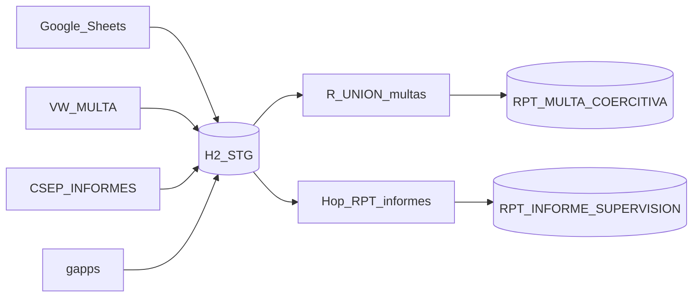
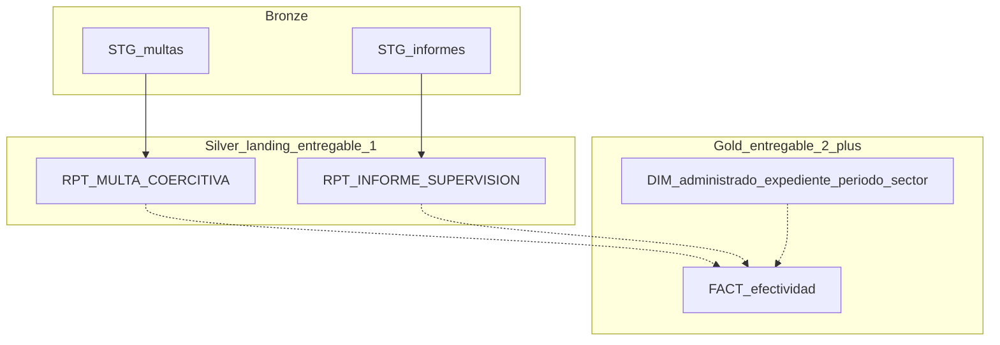

# INFORME TÉCNICO N.° 001-2026-OEFA/DPEF-CSEP

**A:**  
IGOR ELÍAS MEJÍA VERÁSTEGUI  
Director de la Dirección de Políticas y Estrategias en Fiscalización Ambiental del OEFA

**Asunto:** Primer entregable — actividades a), b) y c) del numeral 6 de los TDR  
Requerimiento N.° **3629-2026** (análisis de datos e implementación de técnica para el procesamiento de datos — evaluación de la efectividad de las estrategias de promoción del cumplimiento: **informes de supervisión** y **multas coercitivas**).

**Ref.:** Términos de Referencia del Requerimiento N.° 3629-2026  
**Fecha:** Lima, 13 de agosto de 2026

Es grato dirigirme a usted para informarle el cumplimiento de las actividades **a), b) y c)** del numeral 6 de los TDR, correspondientes al **Primer Entregable**, considerando las fuentes de **multas coercitivas** y de **informes de supervisión** ya integradas al flujo ETL institucional.

---

## 1. Objetivo y alcance

El presente informe sustenta el Primer Entregable del servicio contratado al amparo del Requerimiento N.° 3629-2026, en el marco de la CSEP (DPEF): consolidar, revisar estructuralmente y validar la calidad de la información de promoción del cumplimiento asociada a **informes de supervisión** y **multas coercitivas**.

| Literal | Actividad (TDR, numeral 6) | Cobertura en este informe |
|---------|----------------------------|---------------------------|
| **a)** | Consolidar e integrar fuentes | Multas (Sheets, SISUD, MySQL) + Informes (`CSEP_INFORMES_VIEW`) → dos tablas `RPT_*` en REPOCSEP |
| **b)** | Revisar estructura, campos, clasificación, periodos e indicadores | Granos, llaves y correspondencias de ambos universos |
| **c)** | Validar completitud, consistencia y coherencia | Diagnóstico de calidad; sin depuración (eso es entregable 2) |

**Fuera de alcance del Primer Entregable:** depuración/homologación (d), controles de trazabilidad formal (e), análisis de efectividad (f), cuadros estadísticos (g) y hallazgos de gestión (h). La sección 8 solo **anticipa** el diseño de data warehouse que habilitará el literal f.

Marco institucional (síntesis): Ley N.° 29325 (SINEFA); ROF OEFA art. 42° (DPEF); CSEP (R.P.C.D. N.° 009-2018-OEFA/PCD); Memorando Circular N.° 00004-2026-OEFA/PCD; POI CSEP tarea 014584.

---

## 2. Resumen ejecutivo

| Ítem | Componente | Descripción | Estado |
|------|------------|-------------|--------|
| 1.0 | **a)** Consolidación | ETL `multa_etl` (Apache Hop + H2 + R solo para multas): seis `STG_*` y dos hechos `RPT_*` | Completado |
| 2.0 | **b)** Estructura | Dos granos (informe ≠ multa); diccionarios vía DDL; indicadores tentativos | Completado |
| 3.0 | **c)** Calidad | Diagnóstico multas (corrida 11/08/2026) e informes (llaves y riesgos de puente) | Completado (diagnóstico) |

**Multas — corrida de referencia 11/08/2026**

| Fuente STG | Filas | Marca en `RPT_MULTA_COERCITIVA` |
|------------|------:|----------------------------------|
| GS1 Multas | 16 | `GS1` |
| GS1 Etapas | 55 | `GS_ETAPA` |
| GS2 Multas | 21 | `GS2` |
| Oracle `VW_MULTA_COERCITIVA` | 530 | `ORA` |
| MySQL gapps | 4 | `MYSQL` |
| **Total UNION** | **626** | `REPOCSEP.RPT_MULTA_COERCITIVA` |

**Informes — integración entregable 1**

| Origen | Staging H2 | Destino REPOCSEP | Motor |
|--------|------------|------------------|-------|
| `SISUD.CSEP_INFORMES_VIEW` | `STG_ORA_CSEP_INFORMES` | `RPT_INFORME_SUPERVISION` | **Hop only** (sin R) |

El volumen exacto de informes se confirma en la corrida de validación en Windows (`wf_staging.hwf`); el dump en `docs/input_examples/` es solo plantilla de mapeo.

---

## 3. Metodología

1. Inventario de fuentes CSEP (Sheets, vistas/tablas SISUD y gapps; dump SQL solo como mapeo).
2. Arquitectura por capas: Hop → H2 `STG_*` (reset por corrida) → consolidación diferenciada → REPOCSEP `RPT_*`.
3. Revisión estructural (b): grano, llaves y campos puente.
4. Validación (c): conteos, nulos, duplicados, valores especiales y no-cruces.
5. Trazabilidad de proceso: `FECHA_CARGA` / `FUENTE` (multas); workflow reproducible.

> **Figura 1.** Log Hop de `wf_staging` (incluir Pipeline Informes y Pipeline RPT Informes).

---

## 4. Actividad a) — Consolidar e integrar fuentes

### 4.1 Fuentes integradas

| N.° | Origen | Objeto | Destino STG / RPT |
|-----|--------|--------|-------------------|
| 1 | Google Sheets GS1 | Hojas multas y etapas | `STG_GS1_*` → RPT multas (`GS1`, `GS_ETAPA`) |
| 2 | Google Sheets GS2 | Hoja multas OD Lambayeque / CRES | `STG_GS2_*` → RPT multas (`GS2`) |
| 3 | Oracle SISUD | `VW_MULTA_COERCITIVA` | `STG_ORA_VW_*` → RPT multas (`ORA`) |
| 4 | MySQL gapps | `T_MVC_MULTACOERCITIVA_MC` | `STG_MYSQL_*` → RPT multas (`MYSQL`) |
| 5 | Oracle SISUD | `CSEP_INFORMES_VIEW` | `STG_ORA_CSEP_INFORMES` → **`RPT_INFORME_SUPERVISION`** |

Conexión de origen informes/multas SISUD: `oracle_sisud` (oefabd). Destino analítico: `oracle_repocsep` (REPOCSEP). Credenciales vía variables `DB_*` (no se consignan en este informe).

### 4.2 Criterio de consolidación

- **Multas:** UNION (apilado) con columna `FUENTE`, porque `COD_MA` (planillas) y `CUM` (SISUD) **no son el mismo identificador**. Un INNER JOIN prematuro descartaría o distorsionaría el universo.
- **Informes:** carga **1:1** Hop (una sola fuente, un solo grano). No se mezcla con el UNION de multas.

Orquestación (`wf_staging.hwf`): Reset H2 → Sheets → Oracle multas → **Informes STG** → MySQL → **DDL + RPT Informes (Hop)** → Run R (solo multas) → Success.

> **Figura 2.** Conteos `GROUP BY FUENTE` en `RPT_MULTA_COERCITIVA` y `COUNT(*)` en `RPT_INFORME_SUPERVISION`.

---

## 5. Actividad b) — Estructura, campos, clasificación, periodos e indicadores

### 5.1 Grano (qué es una fila)

| Fuente | Grano | Llave natural |
|--------|-------|---------------|
| GS1 / GS2 Multas | Medida/multa en seguimiento de planilla | `COD_MA` |
| GS1 Etapas | Etapa de proyecto de multa | `COD_PROY_MC` + `NRO_ETAPA_MC` |
| Oracle VW multa | Multa en núcleo SISUD | `CUM` (+ `CAM`) |
| MySQL gapps | Registro de aplicación MC | `NU_IDMC` / `TX_IDCUM` |
| `CSEP_INFORMES_VIEW` | Actividad / informe de supervisión | `IDACTIVIDAD` |

### 5.2 Correspondencia de variables (síntesis)

**Multas — campos puente a RPT:** `COD_MA`, `COD_PROY_MC`, `CUM`, `CAM`, `EXPEDIENTE`, `ADMINISTRADO`, `MONTO_S` / `MONTO_UIT`, `ESTADO`, más bloques de seguimiento Sheets y extras SISUD/gapps.

**Informes — campos de negocio relevantes:** `IDACTIVIDAD`, `TXCUC`, `TXNUMEXP`, `TXADMINISTRADO`, `TXTIPSUP` (REGULAR/ESPECIAL/DOCUMENTAL…), `TXFUENTE` (p. ej. PLANEFA), `TXCOORDINACION`, `TXINFORME`, `FEINFORME`, `TXRECOMENDACION` (p. ej. INICIAR PAS / ARCHIVAR), plazos de elaboración/revisión.

El detalle columna a columna vive en `h2/sql/01_schema.sql` y en los DDL `sql/create_ORACLE_RPT_*.sql` (no se reproduce íntegro aquí por extensión).

### 5.3 Clasificación, periodos e indicadores tentativos

- **Clasificación:** por OD/sufijo `COD_MA` y spreadsheet (multas); por coordinación/sector, tipo de supervisión y fuente PLANEFA (informes); por sistema (planilla vs SISUD vs gapps).
- **Periodos:** fechas Sheets / `FECHA_EMISION` / fechas de informe; **sin corte temporal** aún (depuración = entregable 2).
- **Indicadores tentativos (aún no calculados; insumos ya presentes):** stock SISUD y montos; multas en seguimiento (`COD_MA`); etapas/proyecto; recomendaciones de informe (`TXRECOMENDACION`); cobertura de cruce informe–multa (a definir).

---

## 6. Actividad c) — Validación de calidad

### 6.1 Multas (corrida 11/08/2026)

| Fuente | Filas | Distintos llave | Hallazgo |
|--------|------:|----------------:|----------|
| GS1 | 16 | 12 `COD_MA` | Posibles duplicados / actos sucesivos |
| GS2 | 21 | 18 `COD_MA` | Idem |
| Etapas | 55 | 11 `COD_PROY_MC` | Grano 1:N esperado; join exacto con multas requiere normalizar texto |
| Oracle | 530 | 530 `CUM` | Llave completa |
| MySQL | 4 | 2 `TX_IDCUM` | 50 % sin CUM/CAM |

**Consistencia entre mundos:** GS1 ∩ GS2 vacío (ODs distintas); `COD_MA` ∩ `CUM` = **0**; puente por expediente débil. Valores `#N/A` en Sheets obligaron landing como texto.

### 6.2 Informes

- Llave de negocio: `IDACTIVIDAD`.
- Riesgo estructural: en la muestra del dump, `TXNUMEXP` aparece con alta proporción de nulos → el puente futuro hacia expedientes de multa **no puede asumirse**.
- Dominios a homologar en entregable 2: `TXTIPSUP`, `TXPRY_ESTADO`, `TXRECOMENDACION`.

### 6.3 Coherencia analítica

No sumar filas de `RPT_MULTA_COERCITIVA` + `RPT_INFORME_SUPERVISION` como “un solo número de estrategias”. Son **dos hechos**. Hasta validar puentes, reportar por separado (filtro `FUENTE` en multas; hecho informe por su lado).

> **Figura 3.** Consultas COUNT / COUNT(DISTINCT) y no intersección `COD_MA` vs `CUM`.

---

## 7. Perspectiva de data warehouse y literal f (futuro)

Esta sección **no ejecuta** el literal f; documenta el diseño que el Primer Entregable deja preparado (detalle en `docs/dwh_informes_multas_literal_f.md`).

El literal f exige analizar **informes de supervisión y multas coercitivas** para evaluar efectividad. Eso requiere un modelo de dos hechos y dimensiones compartidas, no un apilado único.

| Capa | Artefacto actual / futuro | TDR |
|------|---------------------------|-----|
| Bronze | H2 `STG_*` | a |
| Silver landing | `RPT_*` (este entregable) | a–c |
| Silver depurado | `FACT_*` limpios | d–e |
| Gold | cruce efectividad, BI | f–h |

**Dimensiones candidatas (entregable 2):** administrado, expediente, periodo, sector/coordinación, estrategia (`TXRECOMENDACION`, `AMERIT_MC`, estados).

**Puentes a probar (no asumir):** `TXNUMEXP`↔expediente multa; administrado; `TXCUC` vs códigos de planilla; `COD_MA`↔`CUM` (ya con intersección 0).

**Roadmap:** mes 1 = dos RPT + calidad (este informe); mes 2 = d–e–f; mes 3 = g–h.

---

## 8. Conclusiones

1. Se cumplió la actividad **a)** al integrar fuentes de **multas** e **informes** en un ETL reproducible, con dos tablas analíticas en REPOCSEP (`RPT_MULTA_COERCITIVA` y `RPT_INFORME_SUPERVISION`).
2. Se cumplió la actividad **b)** al documentar granos distintos, llaves y correspondencias, dejando insumos para indicadores futuros.
3. Se cumplió la actividad **c)** con el diagnóstico de calidad de ambos universos y la advertencia de no mezclar hechos ni forzar cruces inválidos.
4. La arquitectura Hop (informes) + Hop/R (multas) es adecuada para el Primer Entregable y prepara el modelo DWH del literal f **sin adelantar** ese análisis.

---

## 9. Recomendaciones

1. Validar en REPOCSEP los conteos por `FUENTE` (multas) y el `COUNT` de `RPT_INFORME_SUPERVISION` tras la corrida Windows.
2. Acordar con CSEP, antes del entregable 2, la regla oficial de equivalencia medida/planilla ↔ CUM y el puente informe ↔ multa (expediente/CUC/administrado).
3. Tratar `#N/A`, duplicados de `COD_MA` y `TXNUMEXP` nulos en la depuración (literal d).
4. Mantener datasets/hechos separados en consumo analítico hasta validar cobertura de cruce.
5. Insertar las Figuras 1–3 en la versión PDF final.

Es cuanto informo a usted para los fines pertinentes.

Atentamente,

_________________________________  
**Eder Oswaldo Ortega Gonzales**  
Consultor / Especialista  
RUC: 10422020298

---

## Anexo A — Artefactos de sustento

| Artefacto | Ubicación |
|-----------|-----------|
| Workflow | `workflows/wf_staging.hwf` |
| Pipelines informes | `pipelines/pl_stage_informes.hpl`, `pl_rpt_informes.hpl` |
| DDL RPT informes / multas | `sql/create_ORACLE_RPT_*.sql` |
| Consolidación multas (R) | `r/logica/consolidar_multas.R` |
| Diseño DWH / literal f | `docs/dwh_informes_multas_literal_f.md` |
| Skill agentes | `.agents/skills/oefa-csep-etl/SKILL.md` |

## Anexo B — Figuras a insertar

| Figura | Contenido |
|--------|-----------|
| 1 | Log Hop `wf_staging` completo |
| 2 | Conteos RPT multas por `FUENTE` + COUNT informes |
| 3 | Unicidad / no intersección `COD_MA` vs `CUM` |
